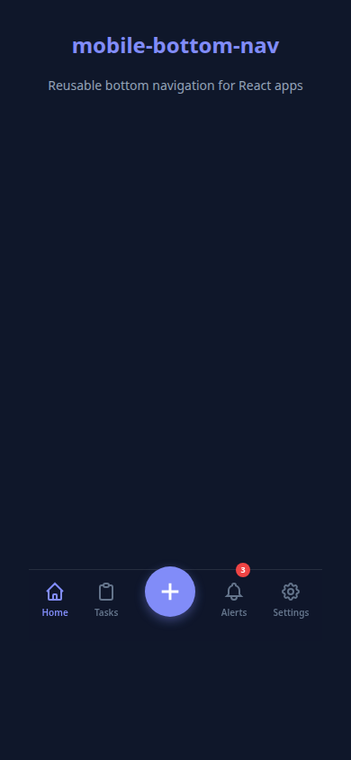

# mobile-bottom-nav



A reusable mobile bottom navigation bar for React apps. Router-agnostic, Tailwind-based, PWA-ready.

Synthesized from patterns across 5 production apps — scrap-sync, project-dashboard, Playbook-Task-App, Haven, and Idea-Foundry — each with slightly different nav needs. This is the version that handles all of them.

## Why this exists

Every mobile React app needs a bottom nav, and every one ends up rewriting it. The requirements are always the same: router-agnostic, hidden on desktop, safe-area aware, accessible, with optional badges and a center FAB. After building this for the fifth time, I extracted it.

## Features

- **Router-agnostic** — pass `navigate` and `currentPath` from any router (wouter, react-router, Next.js, Tanstack)
- **Hidden on desktop** — `md:hidden` CSS gate, no JS breakpoint check, no hydration flash
- **Safe-area aware** — `env(safe-area-inset-bottom)` padding for iPhone home indicator
- **Height reporting** — publishes `--mobile-nav-h` CSS var via `ResizeObserver` so full-screen surfaces can offset
- **Optional center FAB** — elevated circular button between items
- **Badges** — numeric pills and dot indicators with screen-reader context
- **Accessibility** — `aria-current="page"`, `aria-label` with badge context, 44px+ touch targets, focus-visible rings
- **Dark mode** — works with Tailwind `dark:` classes
- **Backdrop blur** — readable over scrolling content

## Install

Copy `src/` into your project, or add as a local dependency:

```json
"dependencies": {
  "mobile-bottom-nav": "file:../mobile-bottom-nav"
}
```

### Required CSS

Add to your global CSS:

```css
.safe-area-pb { padding-bottom: env(safe-area-inset-bottom); }
```

## Usage

```tsx
import { BottomNav } from "mobile-bottom-nav";
import { Home, Plus, Settings, LogOut } from "lucide-react";

function Layout() {
  // wouter example
  const [location, setLocation] = useLocation();

  return (
    <BottomNav
      currentPath={location}
      navigate={(href) => (e) => {
        e.preventDefault();
        setLocation(href);
      }}
      items={[
        { label: "Home", icon: <Home className="w-5 h-5" />, href: "/app", matchPaths: ["/app"] },
        { label: "New", icon: <Plus className="w-5 h-5" />, href: "/app/new" },
        { label: "Settings", icon: <Settings className="w-5 h-5" />, href: "/app/settings" },
      ]}
      actions={[
        { label: "Sign Out", icon: <LogOut className="w-5 h-5" />, onClick: handleSignOut },
      ]}
      fab={{ label: "Add", icon: <Plus />, href: "/app/new" }}
    />
  );
}
```

## License

MIT — use it, fork it, ship it.
